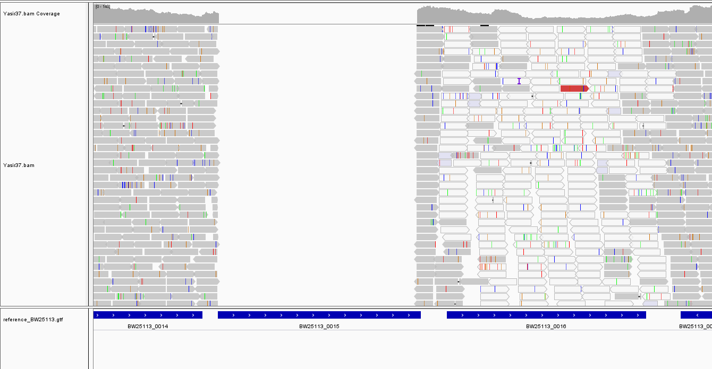

# KO Validation

### Analysis of KO genes in a panel of KO mutants.

This repository contains scripts and outputs from a panel of 50 isolates potentially knocked out in a gene.

The WGS output has been aligned against the reference with _bwa_, and the BAM files have been used to produce a matrix of raw counts using _featureCount_ from the _subread_ package.

